
<h1 align="center">基于SSM的个人事务管理系统的设计和实现+vue</h1>

## 简介
个人事务管理系统：角色分为管理员和用户；功能包括个人中心、用户管理、通讯录管理、财务信息管理、个人事务管理和系统帮助等模块。    --计算机毕业设计源码；毕设源码；java毕业设计源码

## 联系方式

<h3 align="center">获取完整代码与数据库文件 + 微信：deepguan QQ: 86050149 QQ群: 783742310</h3>

<h3 align="center">可帮忙远程部署 包运行成功！提供远程部署、修改代码、设计文档指导、代码讲解等服务！</h3>

## 功能介绍（完整见运行截图）
管理员：负责系统管理，包括用户管理、财务信息管理、通讯录管理、个人事务管理和通知管理等模块。支持用户信息的增删改查、财务记录的管理与审核、事务信息的分配与跟踪，以及系统辅助管理，如修改密码、查看系统帮助等功能。

用户：具备个人事务的管理权限，包括编辑和查看个人信息、通讯录信息、财务数据及个人事务记录等模块。支持通过简单表单进行数据录入和更新，方便快捷地管理个人财务、事务及联系人，具有提交、取消等操作权限。

游客：支持通过登录界面访问系统，用户需输入用户名和密码选择角色进行登录，同时提供注册入口，便于新用户创建账户。登录界面设计简洁，支持管理员和普通用户角色选择。

## 运行截图
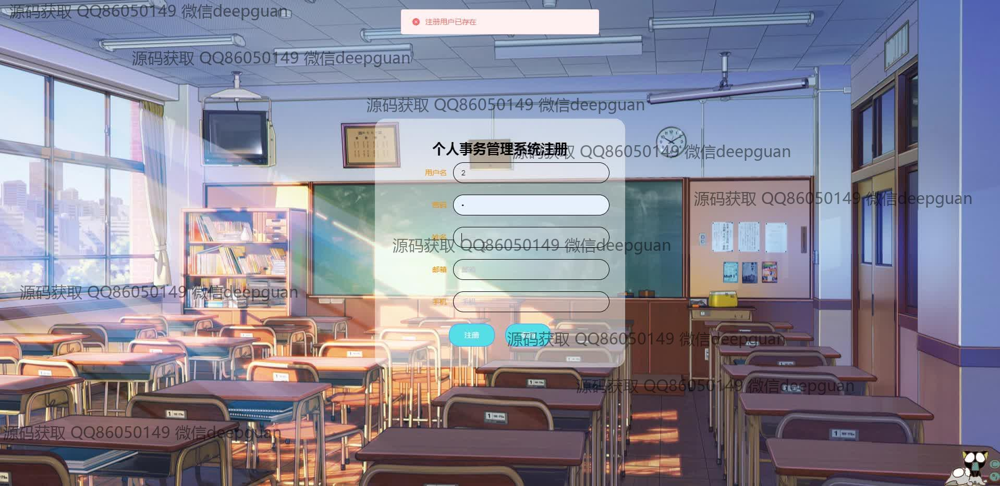
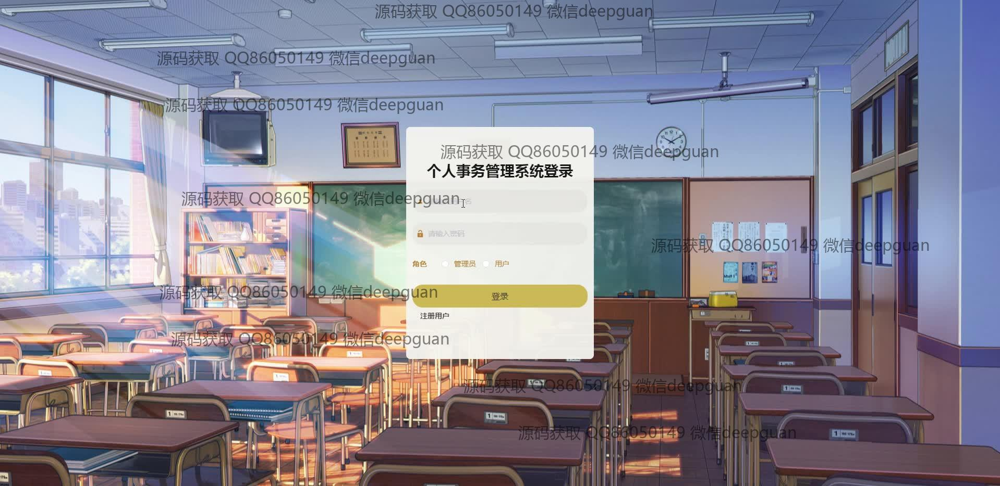
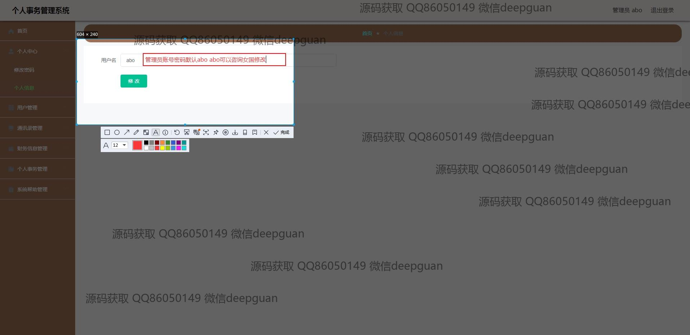
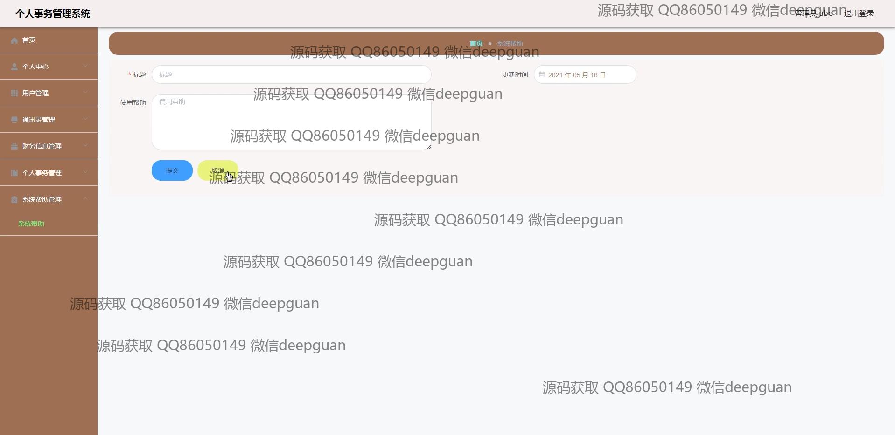
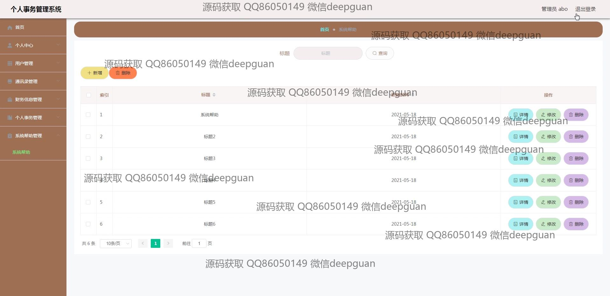
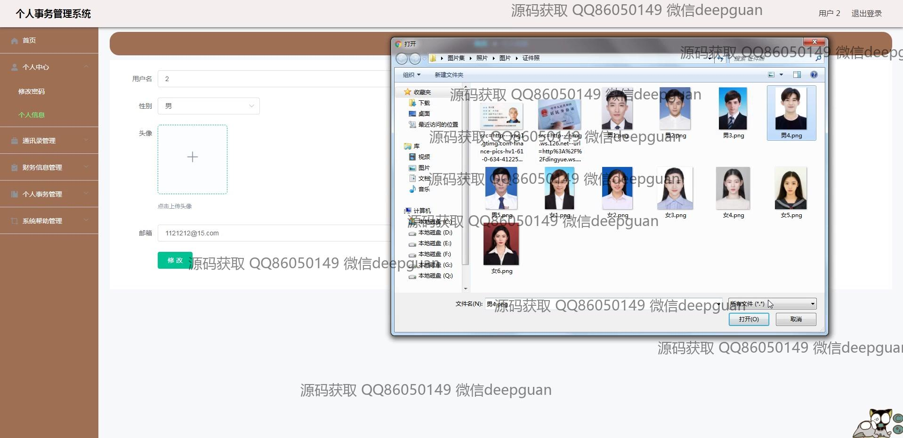
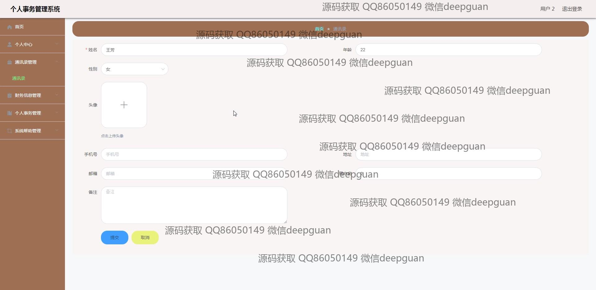
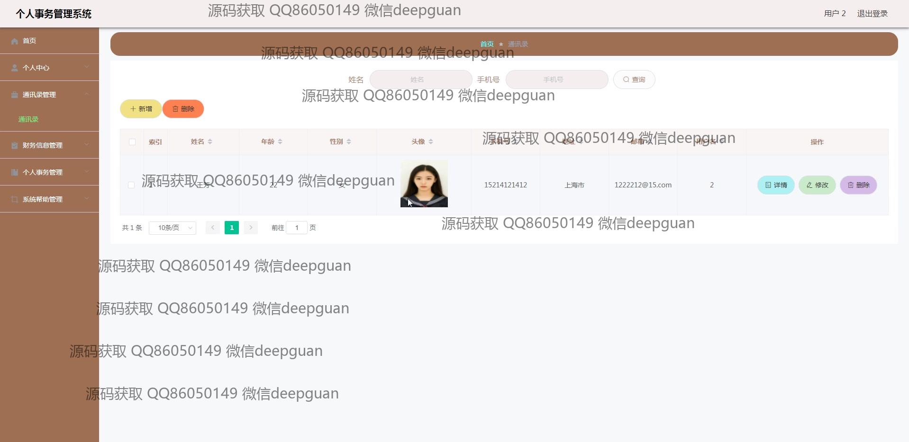
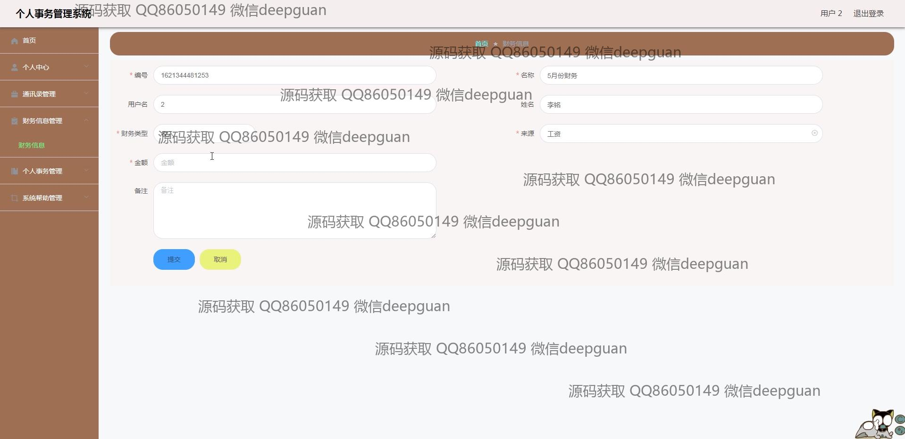
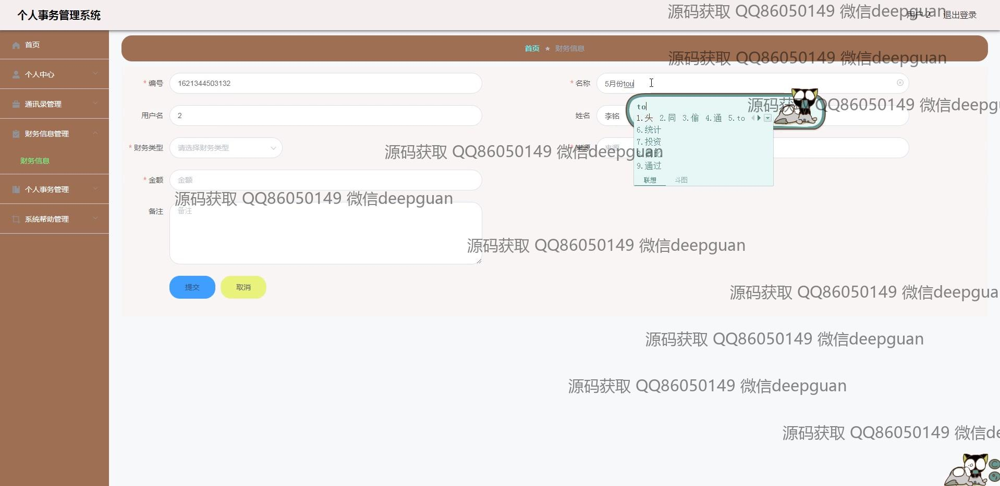
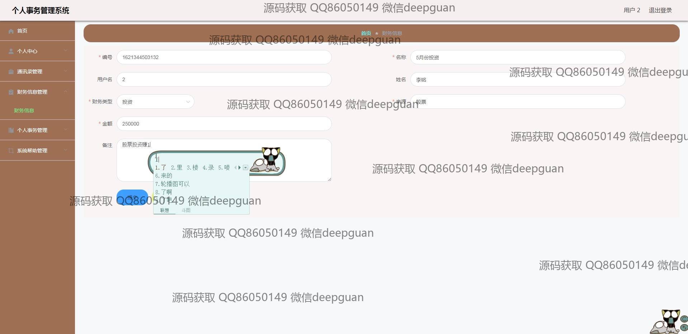
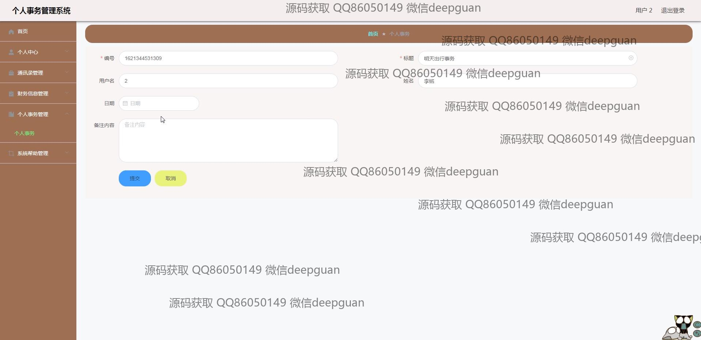
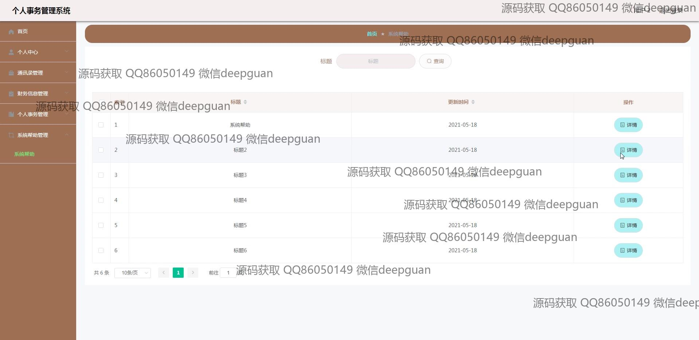
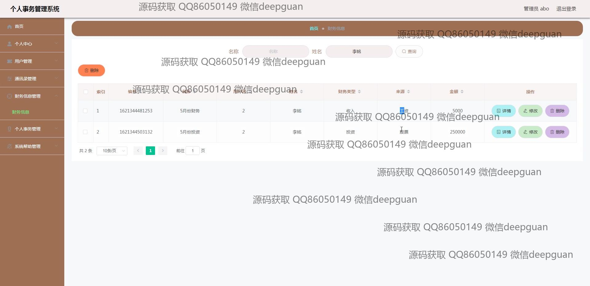

本代码来源于网络,仅供学习参考使用!

